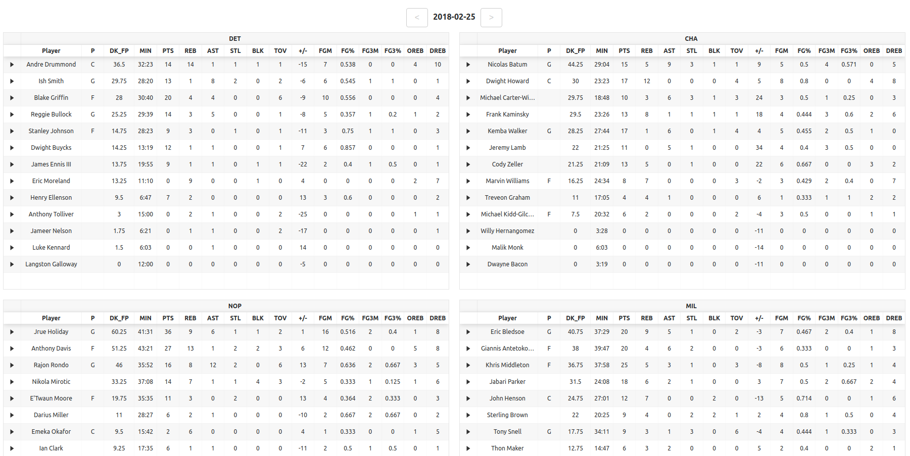
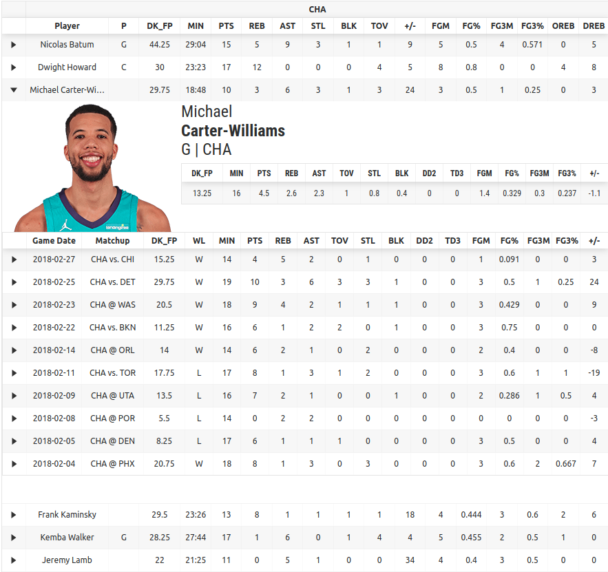
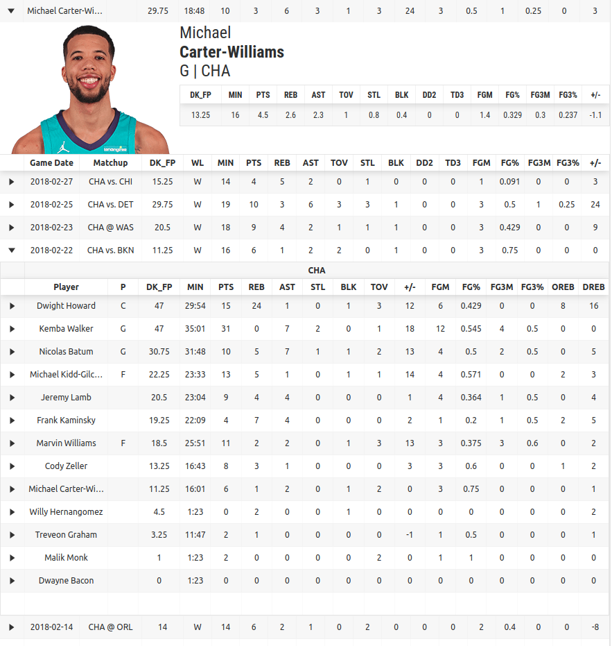
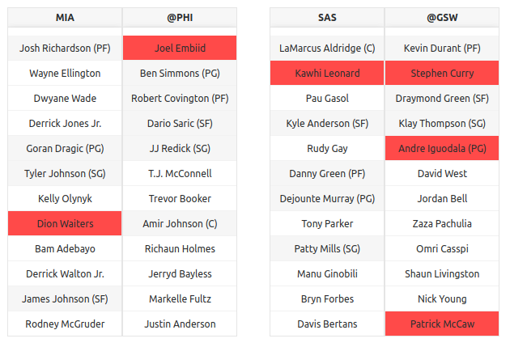
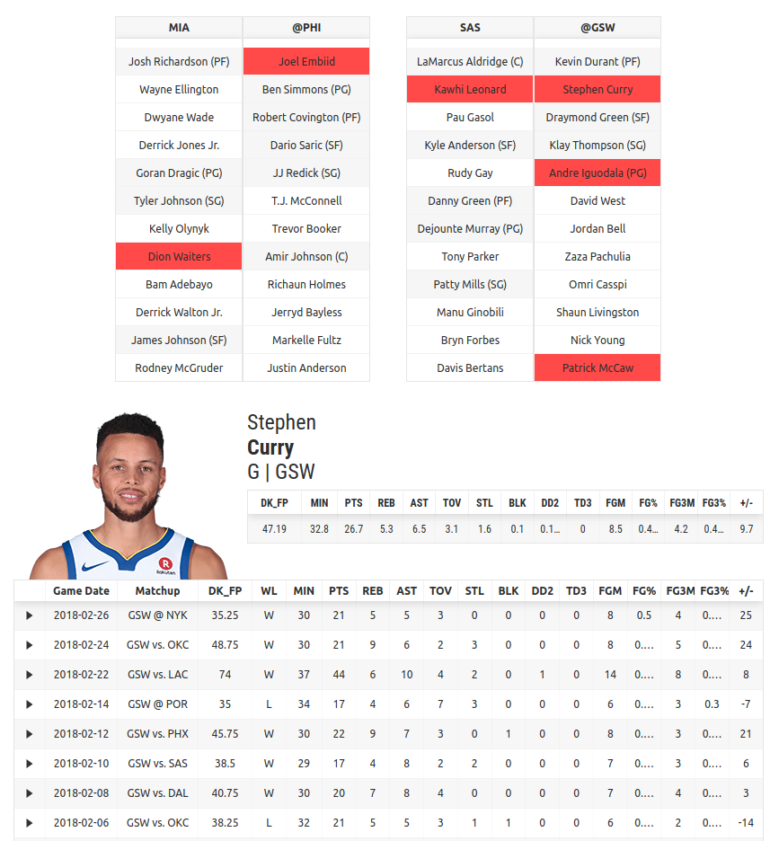

# NBA DFS Dashboard

A react app to display various NBA DFS tools and a python flask backend to serve data through a json api.

## Motivation

Playing NBA DFS well requires me to keep up to date with how players have been doing in recent games and how players are doing right before the game slate starts. Having tools to not only scrape the data but to visualize and interact the data in a clean simple way is extremely helpful for getting the most value out of the data.

I've been able to scrape data easily using my [other tool](https://github.com/jsonchin/nba_stats_scraper_db_storage) and have been using that data to create a model to predict a player's performance each night. While having a model and optimizer that produces lineups is nice, understanding and having confidence in those lineups by easily looking up past performance or today's injuries make it even better.

## Goals/Features

- A tool to look up past game box scores and lookup past player logs without having to open a new tab or new page
- A tool to look at lineups and past injuries and once again lookup past player logs or box scores without having to open a new page

## Instructions

1) Setup and install the needed python and npm packages
```
make setup
```

2) Configure the database path and name in `nba_dashboard/config.py` which uses tables created from scrape jobs located in `api_requests.yaml`. These scrape jobs can be run using my [other tool](https://github.com/jsonchin/nba_stats_scraper_db_storage).

3) Run the app
```
make run
```
and open the app on `http://127.0.0.1:5000/`

## My typical workflow for a day in NBA DFS

1) I review the previous day's games and check for any players that did unusually poorly or well.

- The tool has a page to display the previous day's games detailing the player statistics level of box scores per game. Boxes in the same row played each other. For example, Detroit played against Charlotte.



- Sometimes you see a few suspicious numbers and want to investigate further by looking at their previous games to see if this is a recent trend, a usual performance, or a one game fluke. Clicking on the triangle next to a player loads their past 10 games. Let's click on Michael Carter-Williams under Charlotte since he did fairly well for a low amount of minutes.



- Looking at their past games may lead to more questions such as why he performed poorly in a previous game. So we can expand that game by clicking on the triangle next to the game date.



- This can go on and on as deep as one likes but I find that the expandable nature of this tool without having to navigate to a different page or tab is extremely useful for my NBA DFS needs.


2) I review the lineups for today's games and check out for any injuries and any unusual starters.

- The tool has a page to neatly display the games for the day, the injuries, and the starters. (Scraped from rotowire.)



- Once again, I really like the expandable nature of this tool so by clicking on a player's name, we can popup a player profile underneath that will display their past games and average stats.



- These triangles can lead to a recursive analysis as in the previous games page.
